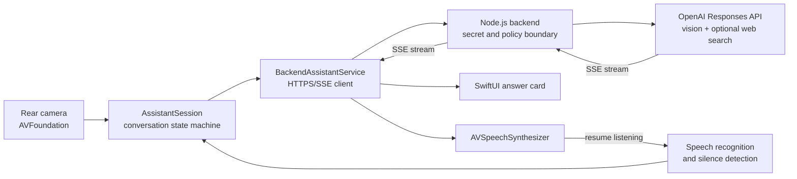

# JARVIS for iPhone

A native iOS visual assistant that combines a live camera, hands-free speech, streamed AI responses, and optional web search in a focused, minimal interface.

Point the rear camera at an object, tap the microphone, and ask a question. JARVIS captures the current frame, sends it through a private backend, streams the answer to the screen, reads it aloud, and automatically resumes listening for a follow-up.

```text
Listen → detect end of speech → capture camera frame → analyze
       → stream answer → speak answer → listen for follow-up
```

> This repository targets iPhone and iOS. It does not require the restricted Vision Pro Main Camera Access entitlement.

## Highlights

- Live rear-camera preview and still-frame capture with AVFoundation
- Hands-free speech recognition with automatic silence endpoint detection
- Streamed visual answers through the OpenAI Responses API
- Optional `web_search` for current facts, specifications, and verification
- On-device text-to-speech with an automatic multi-turn conversation loop
- Recent conversation context for natural follow-up questions
- Typed-question and imported-image fallbacks for accessibility and Simulator testing
- Safe offline demo mode that never uploads images
- Direct mode: enter an OpenAI key in-app (stored in Keychain) to talk straight to OpenAI with no server — works anywhere over cellular
- Server-side API key storage option; with the LAN backend the OpenAI key is never embedded in the app
- Request-size limits, in-memory rate limiting, privacy-preserving client hashes, and `store: false`

## Direct mode: use anywhere, no computer

By default the app talks to a Node backend on your Mac, which means the Mac must
stay on and reachable. To use JARVIS anywhere over cellular with nothing else
running, switch to **direct mode**: the app calls the OpenAI Responses API
itself, and the key is stored in the device Keychain.

Steps on the iPhone:

1. Tap the **···** menu (top right) and choose **直连设置 (API Key)**.
2. Paste an OpenAI API key (create one at platform.openai.com; the account must
   have billing/credit).
3. Tap **保存并启用直连**.

The status pill then shows **直连模式**. From that point:

- No computer, no Node backend, no LAN — the phone calls OpenAI directly.
- Works anywhere on Wi‑Fi or cellular.
- The key lives only in this device's Keychain: encrypted at rest, never written
  into source, the Info.plist, or a scheme; changeable in-app without rebuilding.

Service selection priority is automatic:

1. **Direct** — a Keychain key (or a build-time `OPENAI_API_KEY` / Info.plist
   `OpenAIAPIKey`) is present.
2. **LAN backend** — `JarvisBackendURL` is set and no direct key exists.
3. **Demo** — neither is configured.

Direct-mode configuration keys (all optional; sensible defaults):

| Source | Key | Default | Purpose |
| --- | --- | --- | --- |
| In-app | Keychain (via 直连设置) | — | Runtime OpenAI key; highest priority |
| Env / Info.plist | `OPENAI_API_KEY` / `OpenAIAPIKey` | — | Build-time fallback key |
| Env / Info.plist | `OPENAI_MODEL` / `OpenAIModel` | `gpt-4o` | Vision + web_search capable model |
| Env / Info.plist | `OPENAI_WEB_SEARCH` / `OpenAIWebSearch` | `true` | Toggle the `web_search` tool |

Trade-off: direct mode embeds the ability to spend on your OpenAI account into a
build installed on your own device. It is intended for personal use. For a
shared or distributed build, keep the key server-side and use the LAN/cloud
backend instead. If the `web_search` tool is rejected by your account or model,
set `OpenAIWebSearch` to `NO`; plain visual Q&A still works.

## Architecture



The iOS app owns capture, interaction, and conversation state. The Node.js service is the security boundary: it stores the API key, validates requests, applies limits, and proxies the OpenAI stream. Images are sent only when online mode is explicitly enabled.

## Requirements

| Component | Requirement |
| --- | --- |
| Development Mac | macOS with Xcode 16 or later |
| App target | iOS 17.0 or later |
| Camera testing | A physical iPhone is recommended |
| Backend | Node.js 20 or later |
| AI features | An OpenAI API key with access to the configured model |
| Local development | iPhone and Mac on the same reachable network |

No third-party iOS packages or Node packages are required.

## Quick start: safe demo mode

The repository ships in demo mode. This exercises the camera, speech, UI, and text-to-speech flow without an API key and without uploading a frame.

1. Clone the repository and open `Jarvis.xcodeproj` in Xcode.
2. Select the **Jarvis** target, open **Signing & Capabilities**, and choose your Apple development team.
3. The included bundle identifier belongs to the repository owner. Other developers must replace it with a unique identifier, for example `com.yourname.Jarvis`.
4. Select a physical iPhone and press **Run**.
5. Allow camera, microphone, speech recognition, and local-network access when prompted.
6. Tap the microphone orb and speak. Pause briefly when finished; the turn submits automatically.

The Simulator has no usable rear camera. Use **Import Image** from the app menu to test the visual flow there.

## Enable real visual AI

### 1. Configure the backend

From the repository root:

```bash
cp Backend/.env.example Backend/.env
```

Open `Backend/.env` and set at least:

```dotenv
OPENAI_API_KEY=your_server_side_key
OPENAI_MODEL=gpt-5.6-luna
```

Never add the OpenAI key to Swift code, `Info.plist`, an Xcode scheme, or a committed file. `Backend/.env` is intentionally ignored by Git.

Start the service:

```bash
node Backend/server.mjs
```

You can also double-click `start-backend.command` in Finder. Confirm the service is healthy:

```bash
curl http://127.0.0.1:8787/health
```

A healthy response includes `"ok": true` and `"openAIConfigured": true`.

### 2. Make the backend reachable from iPhone

For local development, find the Mac's Wi-Fi address:

```bash
ipconfig getifaddr en0
```

If the command prints `192.168.1.25`, the app URL should be:

```text
http://192.168.1.25:8787
```

Do not use `127.0.0.1` in the iPhone app; on an iPhone it points to the phone itself. A `.local` hostname may work, but a LAN IP is often easier to diagnose.

### 3. Configure the app

In `Jarvis/Info.plist`, change these values:

```xml
<key>JarvisBackendURL</key>
<string>http://192.168.1.25:8787</string>
<key>JarvisDemoMode</key>
<false/>
```

Alternatively, define `JARVIS_BACKEND_URL` and `JARVIS_DEMO_MODE=false` in the Xcode Run scheme. Scheme environment variables take precedence over `Info.plist`.

Rebuild and run the app. Keep the backend process open while testing.

## Configuration reference

### iOS app

| Setting | Default | Purpose |
| --- | --- | --- |
| `JarvisDemoMode` / `JARVIS_DEMO_MODE` | `true` | Uses the offline response service and does not upload images |
| `JarvisBackendURL` / `JARVIS_BACKEND_URL` | Empty | Base URL of the private backend |
| `JARVIS_BACKEND_TOKEN` | Empty | Optional bearer token matching `JARVIS_APP_TOKEN` |

### Backend

| Variable | Default | Purpose |
| --- | --- | --- |
| `OPENAI_API_KEY` | Empty | Required for real AI responses; server-side only |
| `OPENAI_MODEL` | `gpt-5.6-luna` | Responses API model |
| `JARVIS_APP_TOKEN` | Empty | Optional shared bearer token; required for any public deployment |
| `JARVIS_WEB_SEARCH` | `true` | Enables the Responses API web-search tool |
| `PORT` | `8787` | Listening port |
| `JARVIS_MAX_REQUEST_BYTES` | `10485760` | Maximum JSON request size |
| `JARVIS_REQUESTS_PER_MINUTE` | `30` | Per-address in-memory rate limit |

If `JARVIS_APP_TOKEN` is set, configure the exact same value as `JARVIS_BACKEND_TOKEN` in the app's private Run scheme. Do not commit either value.

## Backend API

### `GET /health`

Returns service readiness without exposing secrets:

```json
{
  "ok": true,
  "service": "jarvis-ios-backend",
  "model": "gpt-5.6-luna",
  "webSearch": true,
  "openAIConfigured": true,
  "authenticationEnabled": false
}
```

### `POST /answer`

Accepts JSON containing the question, JPEG data, recent context, and a generated client identifier:

```json
{
  "question": "What component am I looking at?",
  "imageBase64": "<base64-encoded JPEG>",
  "conversationSummary": "<recent turns>",
  "clientID": "<generated UUID>"
}
```

The response is `text/event-stream`. The backend passes through Responses API events, and the app renders `response.output_text.delta` and `response.refusal.delta` events incrementally.

## App interaction

- **Microphone orb** — starts or stops the hands-free conversation loop. It can also interrupt speech playback.
- **Automatic submit** — a short silence after speech completes the current question; no Send button is required.
- **Import Image** — supplies a still image when the camera is unavailable, including in Simulator.
- **Type Question** — provides a non-voice fallback.
- **Clear Conversation** — removes local conversation history and resets the current session.

## Project structure

```text
JarvisiOS/
├── Jarvis.xcodeproj/
├── Jarvis/
│   ├── JarvisApp.swift             # Application entry point
│   ├── ConversationView.swift      # Minimal camera-first SwiftUI interface
│   ├── AssistantSession.swift      # Conversation state machine
│   ├── CameraManager.swift         # AVFoundation session and JPEG capture
│   ├── CameraPreview.swift         # Live preview bridge
│   ├── SpeechInputManager.swift    # Recognition and silence endpointing
│   ├── SpeechOutputManager.swift   # Text-to-speech and completion handling
│   ├── AssistantServices.swift     # Offline demo and streamed backend clients
│   ├── AssistantModels.swift       # Shared domain models
│   ├── AppConfiguration.swift      # Runtime configuration validation
│   ├── JarvisDesign.swift          # Visual design primitives
│   ├── Info.plist                  # Permissions and safe defaults
│   └── Assets.xcassets/
├── Backend/
│   ├── server.mjs                  # Zero-dependency Node proxy
│   └── .env.example               # Safe configuration template
└── start-backend.command           # Finder-friendly backend launcher
```

## Build verification

To verify compilation without a signing identity:

```bash
xcodebuild \
  -project Jarvis.xcodeproj \
  -scheme Jarvis \
  -sdk iphoneos \
  -configuration Debug \
  CODE_SIGNING_ALLOWED=NO \
  build
```

Camera behavior and permissions must still be verified on a physical iPhone.

## Troubleshooting

### No permission prompt appears

iOS shows each permission prompt only when the app first requests that resource. Check **Settings → Privacy & Security → Camera / Microphone / Speech Recognition**, or **Settings → JARVIS**. If JARVIS is absent, delete the app from the phone, rebuild it, and launch again.

### The camera preview stays black

- Use a physical iPhone; Simulator does not provide the required rear-camera path.
- Confirm Camera access is enabled in Settings.
- Look for `[JARVIS][Camera]` messages in the Xcode console. A `first frame` message confirms capture is running.
- Screen-recording or remote-debug tools can sometimes hide protected camera preview content even while frame capture works.

### Speech starts but no question is submitted

- Allow both Microphone and Speech Recognition permissions.
- Speak, then leave roughly one second of silence for endpoint detection.
- Confirm the active audio route is not an unavailable Bluetooth device.
- Inspect `[JARVIS][Speech]` messages in the Xcode console.

### The phone cannot reach the backend

- Keep iPhone and Mac on the same non-isolated Wi-Fi network.
- Use the Mac's current LAN IP, not `127.0.0.1`.
- Open `http://<mac-ip>:8787/health` from Safari on the iPhone.
- Allow incoming connections for Node in the macOS firewall.
- Confirm `JarvisDemoMode` is `false` and rebuild after changing configuration.

### `HTTP 401: Unauthorized`

`JARVIS_APP_TOKEN` is enabled on the backend but the app token is absent or different. Set matching values on both sides, or leave both empty for trusted local-only development, then restart the backend.

### `HTTP 503: OPENAI_API_KEY is not configured`

Add a valid key to `Backend/.env` and restart the Node process. The `.env` file is loaded at process startup.

### Free developer profile app limit

If Xcode reports that the device has reached the maximum number of installed apps for a free developer profile, delete one of the other development-signed apps from the iPhone and install again.

## Security and production notes

The included HTTP setup is intended only for a trusted local development network. Before exposing the backend beyond that network:

- terminate TLS and use HTTPS;
- require robust authentication instead of an optional shared development token;
- restrict CORS to known origins;
- move rate limiting to a shared persistent store;
- inject secrets through a managed secret store;
- add structured, redacted observability and abuse controls;
- review privacy disclosures and retention requirements for captured images and speech.

The assistant is not a certified medical, electrical, mechanical, chemical, transportation, or life-safety tool. Treat high-risk guidance as informational and verify it with a qualified professional.

## Current limitations

- Conversation is turn-based. Recognition pauses during text-to-speech to prevent feedback loops.
- Speech recognition currently uses the `zh-CN` locale; change it in `SpeechInputManager.swift` for other languages.
- The app retains only a short rolling conversation context and does not persist a full chat history.
- The local backend uses process-memory rate limits, which reset when the process restarts.

## Documentation

- [Apple AVFoundation capture documentation](https://developer.apple.com/documentation/avfoundation/capture_setup)
- [Apple Speech framework documentation](https://developer.apple.com/documentation/speech)
- [Apple AVSpeechSynthesizer documentation](https://developer.apple.com/documentation/avfaudio/avspeechsynthesizer)
- [OpenAI Responses API documentation](https://platform.openai.com/docs/api-reference/responses)
- [OpenAI image input guide](https://platform.openai.com/docs/guides/images-vision)
- [OpenAI tools guide](https://platform.openai.com/docs/guides/tools)
